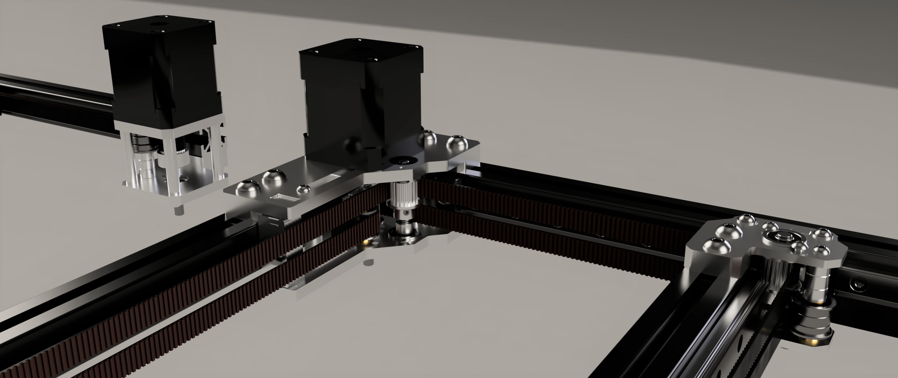

[![CC BY-NC-SA 4.0][cc-by-nc-sa-shield]][cc-by-nc-sa]

# Laser-cut Monolith Gantry [EXPERIMENTAL]
> [!IMPORTANT]
> **If you're looking for a CNC kit experience, this probably isn't for you. But that is also coming later this year.**

## What's this?
It's the experimental sheet metal version of the Monolith gantry that brings R1 features such as live shafts, increased tensioner range, and the optional zero protrusion mode.

### Pros:
- no load-bearing printed parts in the XY motion system
- low cost, easy to source
- high performance
- public CAD

### Cons:
- significantly higher complexity compared to the printed version
- lots of post-processing
- harder to align
- ugly

 

> [!NOTE]
> **If you have questions or want to stay more up to date with Monolith, consider joining the dedicated Discord server.**
>
> 
>
> **If you would like to see more of this and other projects in the future, consider supporting me on Ko-fi.**
>
> 

 

This work is licensed under a
[Creative Commons Attribution-NonCommercial-ShareAlike 4.0 International License][cc-by-nc-sa].

[![CC BY-NC-SA 4.0][cc-by-nc-sa-image]][cc-by-nc-sa]

[cc-by-nc-sa]: http://creativecommons.org/licenses/by-nc-sa/4.0/
[cc-by-nc-sa-image]: https://licensebuttons.net/l/by-nc-sa/4.0/88x31.png
[cc-by-nc-sa-shield]: https://img.shields.io/badge/License-CC%20BY--NC--SA%204.0-lightgrey.svg
