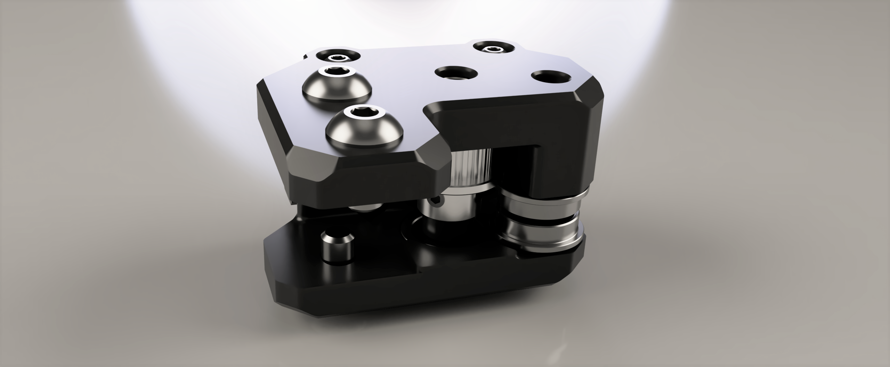
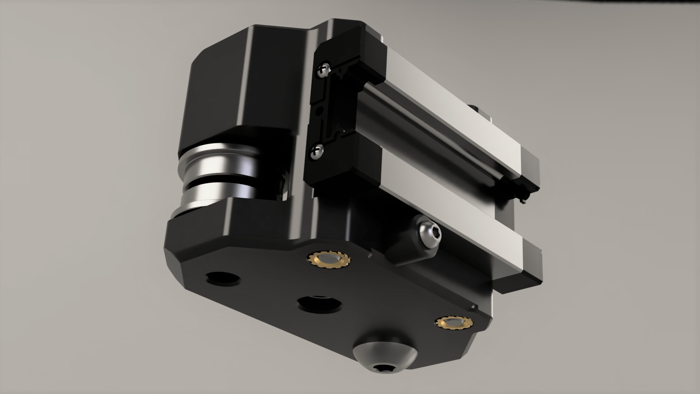

[![CC BY-NC-SA 4.0][cc-by-nc-sa-shield]][cc-by-nc-sa]

# [R1 PRE-RELEASE] Printed Monolith Gantry

### [BOM/Sourcing Guide - Google Sheets - SOON™ ](https://docs.google.com/spreadsheets/d/1RIai7CNpbDsj-eTeLl5jht6svjdHanomWHTbR4IC2LE/edit?usp=sharing)

## Changelog

### v682 - July 12, 2024
- initial upload
- only includes the live-shaft XY joints

 

> [!NOTE]
> **If you have questions or want to stay more up to date with Monolith, consider joining the dedicated Discord server.**
>
> 
>
> **If you would like to see more of this and other projects in the future, consider supporting me on Ko-fi.**
>
> 

 

 

This work is licensed under a
[Creative Commons Attribution-NonCommercial-ShareAlike 4.0 International License][cc-by-nc-sa].

[![CC BY-NC-SA 4.0][cc-by-nc-sa-image]][cc-by-nc-sa]

[cc-by-nc-sa]: http://creativecommons.org/licenses/by-nc-sa/4.0/
[cc-by-nc-sa-image]: https://licensebuttons.net/l/by-nc-sa/4.0/88x31.png
[cc-by-nc-sa-shield]: https://img.shields.io/badge/License-CC%20BY--NC--SA%204.0-lightgrey.svg
